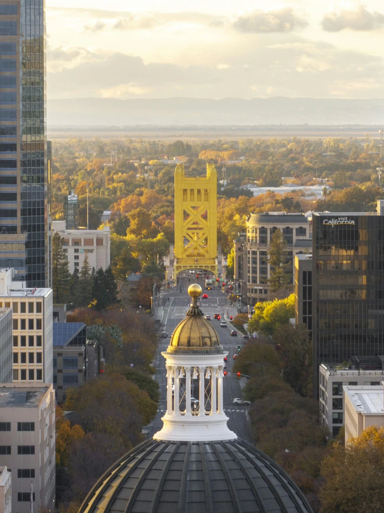
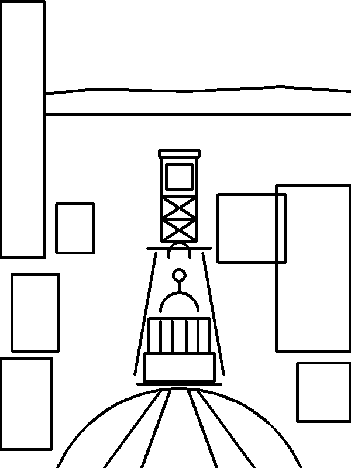

# Sacramento PaintBench (`sacpaint`)

A physical-AI benchmark on [Inspect Robots](https://github.com/robocurve/inspect-robots):
a robot with a pen must reproduce a fixed reference drawing from camera
feedback. One fixed prompt, one pinned reference image, geometric scoring that
anyone can recompute offline from a photo. No printed markers, no special
fixture: a sheet of paper on a desk and any camera, including an iPhone.

> Can a general-purpose frontier model reproduce a visual target with a physical
> tool, using camera feedback to correct itself, with no task-specific training?

The built-in reference is a photograph of Sacramento, shot from above the
Capitol: the Tower Bridge at the end of the Capitol Mall, the Capitol cupola
and dome in the foreground, office towers either side, the valley and the
mountains on the horizon. The model sees the photograph, byte for byte; its
SHA-256 is the benchmark's identity. The scorers never see it: they read a
stroke skeleton traced over the photograph's landmarks (right), because the
scoring is geometric and a photograph has no ink. The physical sheet is
150 × 200 mm, the photograph's own 3:4, small enough for a desk arm such as
the SO-ARM101 to reach every corner.

<p>


</p>

The earlier line-drawing reference (`sacramento-line-v0`) is still registered
as `sacpaint/line-v0` for comparison runs; `sacpaint/photo-v1` is the
benchmark.

## Sixty seconds, no robot

```bash
pip install sacpaint
sacpaint score photo-of-my-drawing.jpg      # any photo of a finished sheet -> score + overlay
```

`score` finds the sheet in the photo (markers if present, otherwise the largest
bright quadrilateral, otherwise corners you pass with `--corners`), rectifies
it to the canonical canvas, and writes three files next to the photo: the
rectified canvas, an overlay with the reference ink in red, and a JSON
breakdown. That is the whole "process a new eval" path for a drawing made by
any robot, any policy, any hardware.

The full benchmark, in the built-in mock plotter world:

```bash
sacpaint run --policy sacpaint_trace --embodiment sacpaint_plotter --no-rerun --no-prompt   # oracle, composite ~0.98
sacpaint run --policy sacpaint_idle  --embodiment sacpaint_plotter --no-rerun --no-prompt   # floor, 0.00
sacpaint export logs --out submission --label oracle                                          # publishable bundle
```

With a frontier model driving the same mock world (needs `pip install inspect-robots-agent` and a key):

```bash
ANTHROPIC_API_KEY=... sacpaint run --policy agent --model anthropic/claude-fable-5 --embodiment sacpaint_plotter -- -P images=on_demand
```

No API key? One flag runs the same policy through a Claude subscription (the
Claude Code CLI, logged in on the machine) for development runs. Scores from
this path are labelled `wire=claude-code-cli` and are not leaderboard-comparable;
see [docs/subscription.md](docs/subscription.md).

```bash
sacpaint run --subscription --model haiku --policy agent --embodiment sacpaint_plotter --max-llm-calls 40 --no-rerun --no-prompt
```

## The prompt

Fixed. Do not tune it per model.

> Draw the reference image on the canvas with the pen. You may look at the
> overhead camera to inspect your work and make corrections. Stop when you
> believe the drawing is complete.

The model receives the reference as an image stream named `reference` (the
photograph at its native 1499 × 2000) and the canvas as a stream named
`overhead`, because the agent policy attaches camera frames to observations and
the instruction cannot carry an image. Every embodiment exposes those two
streams. Nothing tells the model which landmarks are scored: choosing what to
draw from a photograph is part of the task.

## Scoring

All scorers are pure readers of the final canvas. Nothing calls a model. The
final canvas is the `observe_parked()` frame (pen lifted clear), rectified
unless the embodiment marks it canonical, then thresholded to ink (a 1% border
is ignored, because a rectified photograph of a sheet always carries the
sheet's edge there). The reference ink they compare against is the traced
skeleton, `sacramento-photo-v1.ink.png`, whose hash every EvalLog records as
`ink_sha256` next to the photograph's `reference_sha256`.

| Scorer | Weight | What it measures |
|---|---|---|
| `landmark_geometry` | 0.45 | Per landmark: precision × recall of ink inside its box at 1% of the canvas diagonal (2.5 mm) after centroid alignment (presence), times a centroid-offset term (position). Plus relations (tower over dome, same x, horizon above tower), gated on both landmarks being present. |
| `structure` | 0.30 | Precision × recall of all ink within 2% of the diagonal (5 mm) of reference ink. Product, not F1, because a dense scribble recalls everything. |
| `discipline` | 0.15 | 1 − fraction of ink farther than 2.5% of the diagonal (6 mm) from any reference ink, scaled down past 4× the reference's ink. Blank canvas scores 0. |
| `efficiency` | 0.10 | 1 − steps/max_steps for a declared finish; scaled by `structure` in the composite so finishing a bad drawing fast earns nothing. |
| `composite` | | The leaderboard number. |

Calibration on synthetic canvases:

| Canvas | composite | landmark | structure | discipline |
|---|---|---|---|---|
| perfect trace | 0.98 | 1.00 | 1.00 | 1.00 |
| perfect trace photographed at an angle, plain sheet, rectified | 0.97 | 0.97 | 1.00 | 1.00 |
| hand wobble, σ = 1 mm | 0.97 | 0.97 | 1.00 | 1.00 |
| whole drawing shifted 5 mm | 0.77 | 0.63 | 1.00 | 0.69 |
| top half only (bridge, no dome) | 0.53 | 0.38 | 0.55 | 1.00 |
| random scribble, 30 / 60 / 400 lines | 0.30 / 0.42 / 0.33 | 0.32 / 0.47 / 0.33 | 0.28 / 0.41 / 0.43 | 0.33 / 0.35 / 0.09 |
| blank | 0.00 | 0.00 | 0.00 | 0.00 |

Through the CLI with the framework's default guardrails, 3 epochs: oracle
`sacpaint_trace` composite 0.984, `sacpaint_idle` 0.000.

Known properties: global registration counts (a 5 mm offset is a placement
error, by design); a dense random scribble still collects about 0.3 to 0.5
because the skeleton covers much of the canvas (measured 2026-09-09: 30, 60
and 400 random lines score 0.33, 0.47 and 0.44 against the oracle's 0.995);
the tower, dome and cupola dominate through their weights.

## Media

Every score carries `medium`, what the marks were made of. Each medium is its
own leaderboard category: a number is only ever ranked against numbers made
the same way.

| Medium | What it is | Category |
|---|---|---|
| `pen` | a pen on a sheet, photographed | the benchmark proper |
| `virtual` | no paper, no pen: the real arm moves, and the canvas is inked from where the arm *measured* its tip after each pen-down move (`-E medium=virtual` on the OpenCastor body) | its own category: real arm, real policy, exact and unobstructed canvas |
| `sim` | the mock plotter | development only, never ranked |

Different media are the intended next axis of the benchmark, not a footnote:
brush and watercolour on paper, marker, chalk, a plotter pen, each with its
own rubric (a wash is scored on coverage and edges, a pen on lines), and
stylised rubrics that reward a named artist's way of seeing the same photo. A
medium is a `(body, scoring rubric)` pair; the reference stays the photograph.

## No paper? The virtual easel

A rig with an arm but nothing to draw with can still run the whole loop. With
Bob's calibrated joint limits a flat sheet fits nowhere on the desk, so the
virtual sheet stands upright 325 mm in front of the base, like a canvas on an
easel; the arm draws in the air and the ink is telemetry:

```bash
sacpaint run --policy sacpaint_trace --embodiment opencastor --no-rerun --no-prompt \
  -- -E pair_payload=/path/to/pair-payload.json -E medium=virtual -E calibration=easel \
     -E move_tool=arm.reach_point -E move_args=reach_point -E tolerance_mm=5 -E strict_reach=false
```

`strict_reach=false` lets a target the arm could not quite reach be inked where
the arm actually got to (the miss count is in every observation); with a real
pen that would be a fault. `-E easel_distance_mm`, `-E easel_elevation_deg` and
`-E easel_azimuth_deg` move the easel; the defaults were measured on an
SO-ARM101 (see `sacpaint/opencastor/calibration.py`).

## Tracks

| Track | Memory across episodes | Camera | Measures |
|---|---|---|---|
| Cold | none | `-P images=on_demand`, never called | raw open-loop competence |
| Closed loop (default) | none | throughout | self-correction within one drawing |
| Learning | prior attempts via `inspect-robots summarize` + `-P prior_learnings=` | throughout | improvement across 5 canvases |

The learning track reuses the framework's own `summarize` / `prior_learnings`
mechanism, so the "memory" is an auditable markdown file with a recorded hash.
Report initial, final, best-of-5, and slope per attempt.

## Your own reference in two commands

```bash
sacpaint new mytown --canvas 210x297 --photo mytown.jpg   # spec + preview PNG in ~/.sacpaint/references/
sacpaint run --task sacpaint/mytown --policy sacpaint_trace --embodiment sacpaint_plotter -- -E reference=mytown
```

A reference is a JSON file of polylines grouped by landmark (millimetres,
origin bottom-left, y up), optional landmark weights and boxes, relations
(`above`, `left_of`, `same_x`), tolerances, and optionally a `photo` the model
sees instead of the strokes (then the strokes are the scoring skeleton: trace
the photo's landmarks). Every spec in `~/.sacpaint/references/` registers as
the task `sacpaint/<name>` the moment the package is imported. The built-in
spec is at `src/sacpaint/assets/sacramento-photo-v1.spec.json`; copy it, edit
it, done.

## Real robots

Any embodiment that exposes this contract runs the benchmark unchanged:

- action space `eef_abs_pose`, dims `(x, y, z)` in metres in the canvas frame
  (x right, y up the sheet, z above the paper; the pen marks at z ≤ 0.002 m,
  travels at z ≥ 0.005 m);
- images `overhead` and `reference`, state `eef_pos` (3,);
- `supported_target_kinds` includes `reference_drawing`;
- `observe_parked()` lifts the pen clear and returns a fresh observation;
- corners of the sheet in the overhead frame, if known, as
  `observation.extra["canvas_corners"]` (four `[x, y]` pairs, 0..1, TL TR BR BL);
  otherwise the scorer finds the sheet itself.

| Body | How |
|---|---|
| Mock plotter (built in) | `--embodiment sacpaint_plotter`, options `-E reference=NAME -E photo_mode=sheet` |
| OpenCastor + SO-ARM101 with signed receipts | [docs/opencastor.md](docs/opencastor.md): `--embodiment opencastor` |
| iPhone as the overhead camera, corner marker, and operator microphone | the OpenCastor iOS app's Eval mode (TestFlight build 76): frames and tapped corners go to the robot console, the embodiment polls them; see [docs/opencastor.md](docs/opencastor.md) |
| Any other arm | implement the contract above; `inspect-robots-so101` (LeRobot, joint space) is a fallback body that needs the agent's `move_joints` |

## Publishing a run the way robocurve does

```bash
sacpaint export logs --out submission --label opus
```

produces the layout of robocurve's published run datasets (clapboardbench):

```
submission/
 ├── README.md                     # provenance, reference hash, how to recompute
 ├── <log>.json                    # raw EvalLog: config, git rev, versions, scores, transcript
 ├── runs/README.md                # index table: model, policy, embodiment, status, composite, steps
 ├── runs/<label>-<n>.md           # one page per run: metadata, scores per epoch, per-landmark table,
 │                                 #   final canvas, the model's note for every tool call
 ├── html/                         # inspect-robots view reports (frames the model saw)
 ├── canvases/                     # the rectified final canvas and score JSON per trial
 ├── videos/                       # inspect-robots video (when ffmpeg is installed)
 └── reference.png, reference.sha256, rubric.json
```

`sacpaint worldevals-entry` prints the `Benchmark(...)` block for a
[WorldEvals](https://github.com/robocurve/worldevals) catalog pull request.

## Status

| Piece | State |
|---|---|
| Task `sacpaint/photo-v1` (the photograph), five scorers, three epochs | done, registered via entry points; `sacpaint/line-v0` kept |
| Mock plotter + oracle/idle policies | done; the whole stack runs with no hardware |
| Marker-free rectification (given corners, ArUco, plain sheet) | done, tested under perspective |
| `sacpaint score / new / run / export / worldevals-entry` | done |
| `--policy agent` (frontier LLM) | works against the mock; needs a key or the subscription shim |
| OpenCastor / SO-ARM101 embodiment | see docs/opencastor.md |
| Hardware runs | virtual medium on an SO-ARM101 (Bob) 2026-09-09: the arm traces the easel, see docs/opencastor.md; pen on paper not yet |
| WorldEvals catalog entry | after the first real-robot log |

## Development

```bash
git clone https://github.com/craigm26/sacpaint && cd sacpaint
uv venv && source .venv/bin/activate && uv pip install -e ".[dev,agent]"
pytest
```

Regenerate the built-in assets (only when the reference itself changes; it re-versions the task):

```bash
python -c "from sacpaint.reference import write_assets; write_assets('src/sacpaint/assets')"
```

MIT.
